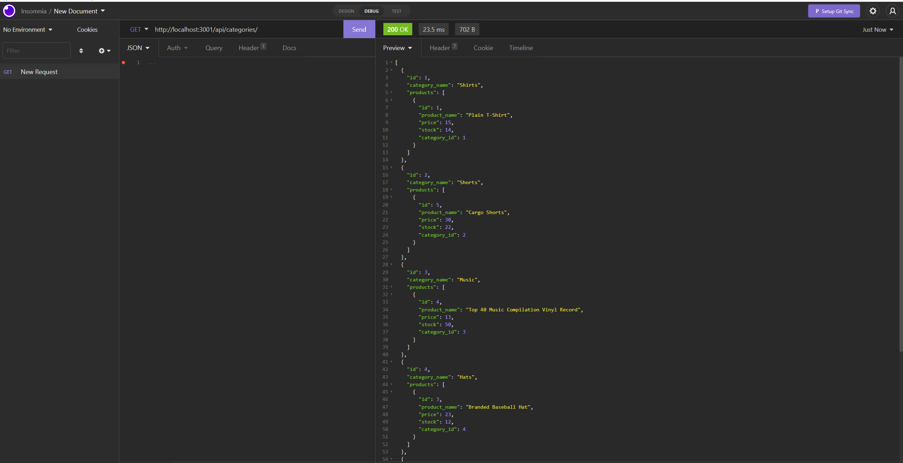
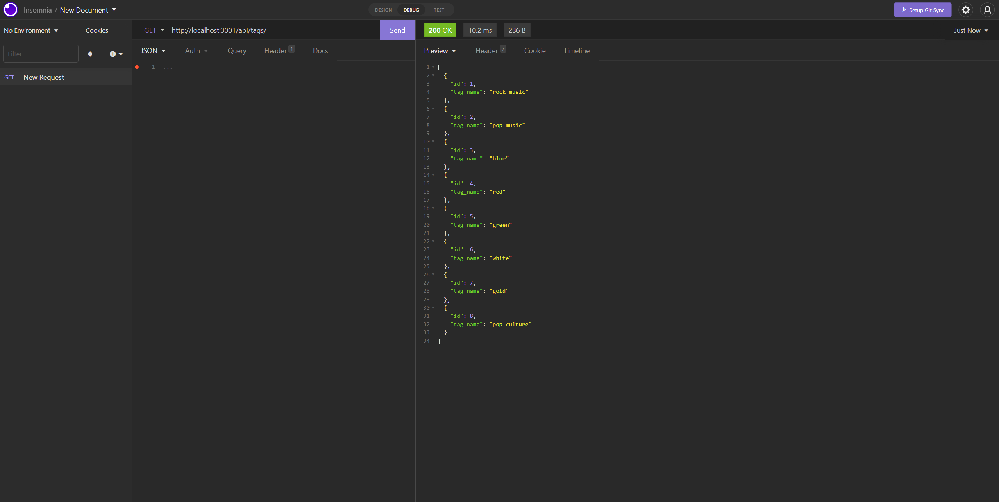
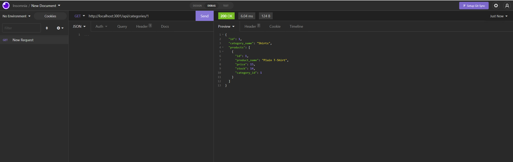
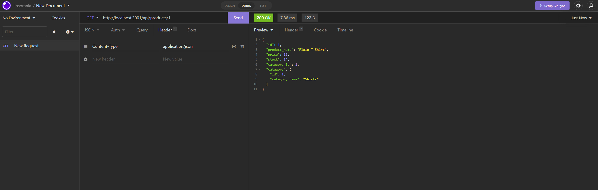
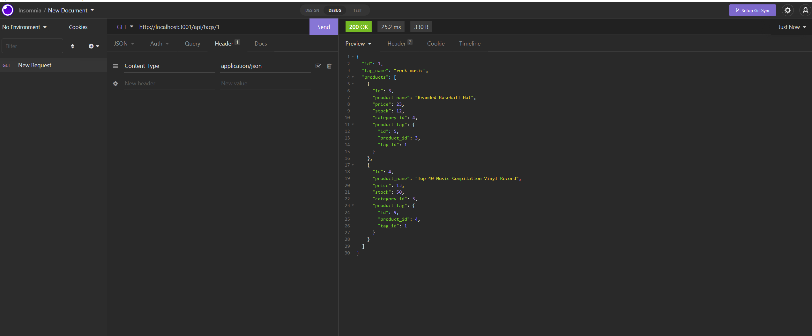

# E-Commerce-Back-End  
  
  
## Table of contents   
-[Description](#Description)   
-[Images](#Images)     
-[Installation](#Installation)  
-[Contact Me](#Contact-Me)    
-[License](#License)  
-[Contributors](#Contributors)  

## Description  
Internet retail, also known as **e-commerce**, is the largest sector of the electronics industry, generating an estimated $29 trillion in 2019. E-commerce platforms like Shopify and WooCommerce provide a suite of services to businesses of all sizes.  
```md
AS A manager at an internet retail company
I WANT a back end for my e-commerce website that uses the latest technologies
SO THAT my company can compete with other e-commerce companies
```  
[Video Link]()  

## Images 
### View All 
  
  
   
### View By ID  
  
  
  
### View All Other Methods In The Video!

## Installation     
`git clone git@github.com:Phillip48/E-Commerce-Back-End.git`  

## Contact Me  
Github: Phillip48  
Email: phillip482@icloud.com  

## License
This project is licensed under MIT.

## Contributors  
*Phillip48*  
